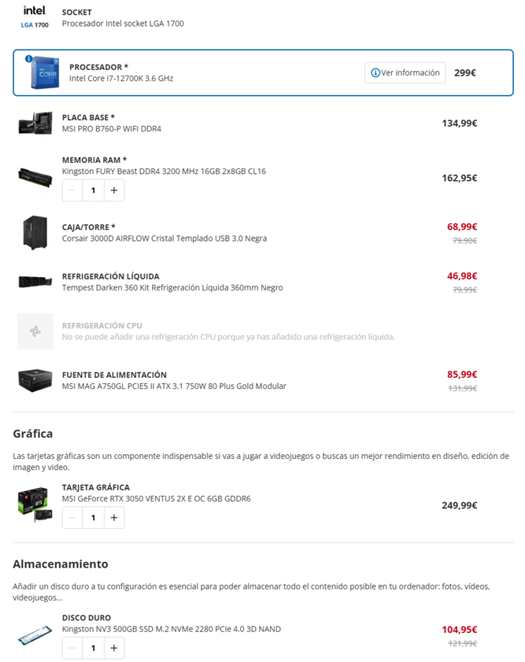

# 1. CYBERFORCE - ANÁLISIS COMPLETO DE HARDWARE

## 1.1 ANÁLISIS DE LAS NECESIDADES DEL HARDWARE

Para los equipos de **desarrollo, formación y soporte técnico**, se ha elegido una configuración más potente que la de los equipos destinados únicamente a desarrollo o soporte técnico, en caso de que sea necesario realizar tareas que requieran mayor capacidad.

Entre estas tareas se incluyen:

- Retransmisión de vídeo
- Inicio de laboratorios más complejos
- Conexiones simultáneas con máquinas virtuales para explicaciones

Se ha seleccionado memoria RAM **DDR4** debido a los altos precios actuales en el mercado y a que se ha considerado que no compensaba optar por la última tecnología. En un futuro, se podría estudiar el cambio a la siguiente generación.

En total, la infraestructura estará compuesta por:

- **22 equipos**
- **3 servidores**
- **3 puntos de acceso (Access Points)**

---

## 1.2 COMPONENTES DE UN EQUIPO INFORMÁTICO

A continuación se describen los principales componentes de un equipo informático:

### CPU

La CPU es el componente encargado de procesar toda la información del sistema ejecutando instrucciones mediante operaciones aritméticas y lógicas. Está formada por núcleos (cores), que permiten realizar varias tareas a la vez. Incluye memoria caché y su rendimiento depende de la frecuencia (GHz), número de núcleos e hilos.

### Memoria RAM

La RAM es la memoria temporal donde se almacenan los datos en uso, permitiendo a la CPU acceder rápidamente a programas y datos activos. Es volátil y se borra al apagar el equipo. A mayor capacidad (GB), mejor rendimiento en multitarea. Su velocidad se mide en MHz

### Placa base

La placa base es la estructura donde se conectan y comunican todos los componentes. Integra el socket de la CPU, ranuras para RAM y conexiones de almacenamiento. Incluye el chipset y la BIOS/UEFI, además de puertos de entrada/salida.

### Almacenamiento

Los dispositivos de almacenamiento guardan los datos de forma permanente. Existen varios tipos como **HDD, SSD y NVMe**, utilizados para sistema operativo, programas y archivos.

### Fuente de alimentación

La fuente de alimentación proporciona energía a todos los componentes. Su potencia debe ser suficiente para todo el sistema y puede ser modular, semimodular o no modular.

---

## 1.3 CONFIGURACIÓN DE HARDWARE PROPUESTA

## Equipos de desarrollo, formación y soporte técnico

Los equipos más potentes cuentan con una **tarjeta gráfica superior** y opción de **overclock (OC)** en caso de necesitar mayor rendimiento en situaciones puntuales.

También se han seleccionado:

- Licencias de **Windows 11 y Microsoft Office**, debido a su uso diario
- Uso principal de **distribuciones Linux**
- **Almacenamiento SSD de 1 TB**, suficiente gracias al uso de servidor y nube

---

## Equipos de administración y dirección

Para estos equipos:

- Se mantiene la misma CPU
- Se reduce el almacenamiento a **512 GB**
- Se reduce la potencia gráfica (aunque se mantiene opción OC)
- No se incluyen licencias de Windows ni Office (uso exclusivo de Linux)

---

## Servidor

El servidor presenta las siguientes características:

- Uso de **RAM DDR5** para mayor rendimiento
- Almacenamiento en **HDD ampliable**
- Preparado para **virtualización y servicios de red**

---

## Red (Switch, Router y Access Point)

### Switch

Se ha elegido un switch que permite gestionar las claves de la red.

### Router

El router seleccionado es modular, permitiendo añadir tarjetas y adaptarse a necesidades futuras, además de soportar más protocolos.

### Access Point

Modelo con banda de **5 GHz y 240 Mbps**, suficiente para el uso previsto.

---

## Periféricos y extras

Se han seleccionado periféricos básicos:

- Teclado de **membrana** (menor ruido)
- Ratón **ergonómico e inalámbrico**
- Monitor de **27” con buena tasa de refresco** y altavoces

También se incluye:

- Cámara para reuniones y videollamadas

---

## Otros elementos

Aunque no son hardware directamente, se han considerado como parte del entorno de trabajo:

- Mesa
- Silla

---

## 1.4 SISTEMA DE ALMACENAMIENTO

En el proyecto se han utilizado **NVMe PCI 4.0**, destacando por su buena relación calidad-precio y alta velocidad.

El sistema de almacenamiento se compone de:

- Almacenamiento local en equipos (SSD/NVMe)
- Servidor con capacidad ampliable
- Almacenamiento en nube mediante **AWS**

Gracias a esta combinación:

- Se evita añadir más hardware físico
- Se optimiza el uso de los recursos existentes
- Se garantiza escalabilidad futura

---

## 1.5 COMPARATIVA O MEJORA DEL HARDWARE

La especialización de equipos según las tareas se refleja en las diferencias de hardware, aunque todos los equipos cuentan con una buena CPU y suficiente RAM para laboratorios.

### Posibles mejoras

- Ampliación de RAM a **16 GB en dual channel**
- Migración futura de **DDR4 a DDR5**
- Actualización de CPU y placa base a modelos más actuales

### Escalabilidad

El sistema está diseñado para crecer fácilmente:

- Posibilidad de añadir más equipos
- Servidor modular ampliable
- Uso de nube para expansión sin hardware adicional