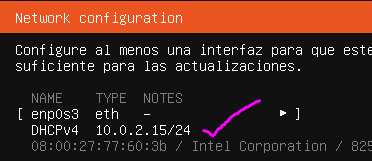

# 3. INSTALACIÓN DEL SISTEMA OPERATIVO

La instalación de los sistemas operativos en la infraestructura se ha realizado siguiendo los métodos definidos en el plan de implantación (2), diferenciando entre servidores, equipos de usuario y el servidor de virtualización (LAB).

El objetivo principal ha sido garantizar que todos los sistemas queden correctamente instalados, funcionales y preparados para su posterior configuración dentro de la red segmentada por VLANs.

---

## 3.1 INSTALACIÓN MANUAL (SERVIDORES - UBUNTU SERVER)

Para los servidores del CPD y el servidor web de **CyberForge** se ha realizado una **instalación manual de Ubuntu Server**, ya que requieren una configuración específica.

> *En un entorno real, este proceso se realizaría sobre servidores físicos utilizando un USB booteable. Sin embargo, como se trata de un entorno de prácticas, la instalación se ha **simulado en un equipo personal mediante virtualización** usando VirtualBox, lo que permite replicar el proceso real sin necesidad de hardware dedicado.*
> 

### 🔴 EN UN ENTORNO EMPRESARIAL REAL

1. **Preparación del servidor físico →** se configura su BIOS/UEFI y un RAID si fuese necesario.
2. **Arranque desde el medio de instalación →** se carga la ISO de Ubuntu Server mediante un USB booteable.
3. **Instalación del sistema** → se selecciona idioma, teclado, se configura una IP estática, se realiza el particionado de discos y se instalan los paquetes base.
4. **Configuración inicial** → se le asigna un nombre al servidor (hostname), se crea el usuario administrador y se configura SSH.
5. **Validación** → se comprueba que la conectividad funciona y que el acceso remoto está operativo.

### 🔵 EN ESTE PROYECTO (SIMULACIÓN EN EQUIPO PERSONAL)

1. **Arranque desde el medio de instalación:**
    - Se crea una máquina virtual en VirtualBox con las siguientes características:
        - 2 GB de RAM
        - 2 CPU
        - 20 GB de disco
    - Se monta la ISO de Ubuntu Server
2. **Configuración inicial**
    - Selección de idioma y teclado
    - Red:
        - *En el entorno real, se configuraría direccionamiento IP estático para integrarse en la VLAN correspondiente (VLAN 60)*
        - En este entorno “simulado”, se deja en DHCP (automático)
            
            
            
3. **Particionado del disco**
    - Se elije usar todo el disco y el sistema crea automáticamente:
        - `/`(sistema)
        - `swap`(memoria virtual)
            
            
            
4. **Creación del usuario administrador**
    - Se configura el nombre de usuario y la contraseña:
        - Nombre de usuario → `cforge_serveruser`
        - Contraseña → `*********`
    - Esto simulará el administrador del servidor de CyberForge
        
        
        
5. **Instalación de paquetes básicos**
    - Se marca **Install OpenSSH server**. Esto permitirá:
        - Conectarse remotamente al servidor
        - Administrarlo sin estar físicamente delante
            
            
            
6. **Últimas comprobaciones**
    - Se reinicia la máquina virtual y se ingresa con el nuevo usuario
        
        
        
    - Se verifica la conectividad de red y el correcto funcionamiento del sistema tras la instalación
        
        
        

**Aunque la instalación se ha realizado en un entorno virtualizado, el procedimiento seguido es equivalente al de un entorno real, permitiendo simular la implantación de servidores en una infraestructura profesional**

---

## 3.2 INSTALACIÓN MEDIANTE IMÁGENES (EQUIPOS DE USUARIO)

En los equipos de usuario se ha utilizado un sistema de **instalación mediante imágenes**, especialmente útil debido al número de equipos y su facilidad para clonarse.

> *En un entorno real, se prepararía un equipo base y se clonaría en múltiples equipos físicos mediante herramientas de despliegue. En este caso, al tratarse de un entorno de prácticas, el proceso se ha **simulado mediante máquinas virtuales** usando VirtualBox*
> 

### 🔴 EN UN ENTORNO EMPRESARIAL REAL

1. **Creación de imagen maestra →** se instala el sistema base (Windows 11 / Ubuntu Desktop), el software corporativo y se realiza una configuración estándar según equipo.
2. **Captura de la imagen →** se clona la imagen base mediante herramientas como Clonezilla
3. **Despliegue en red →** el uso de PXE (Preboot Execution Environment), que significa Entorno de Ejecución Prearranque en español,  permite una instalación automatizada en múltiples equipos.
4. **Post-configuración:**
    - Unión al dominio
    - Aplicación de políticas
    - Configuración de usuario

### 🔵 EN ESTE PROYECTO (SIMULACIÓN EN EQUIPO PERSONAL)

1. **Creación de la máquina base → se crea una máquina virtual inicial que actuará como imagen de referencia.**
    - 2 CPU
    - 4 GB RAM
    - 20-40 GB disco
    - Montaje de ISO correspondiente
    
    
    
2. **Instalación de los sistemas operativos → se instalan Ubuntu Desktop y Windows 11 Pro siguiendo los asistentes de instalación.**
    
    
    
    
    
3. **Preparación de la imagen → se limpian los sistemas antes de la clonación**
    - Ubuntu Desktop
    
    ```bash
    sudo apt clean
    history -c
    sudo poweroff
    ```
    
    - Windows 11 Pro → se eliminan archivos temporales, se vacía la papelera y se apaga el sistema.
4. **Clonado → se clonan las imágenes base usando Clonezilla, añadiéndole su imagen a las máquinas virtuales que vamos a clonar. Para esto, se crea un nuevo disco en cada máquina para almacenar la clonación.**
    
    *El segundo disco virtual no contenía inicialmente un sistema de archivos, por lo que no era detectado como destino válido en Clonezilla. Se procedió a crear una partición y formatearla en ext4 para poder utilizarlo como repositorio de imágenes.*
    
    - Se añade la ISO de Clonezilla y se arranca la máquina desde esta.
        
        
        
    - Se crean las imágenes para los sistemas de Ubuntu y de Windows
    
    
    
    
    
    
    
    
    
    - Se crea una nueva máquina virtual, se arranca con Clonezilla y se añade la imagen creada desde **restoredisk**. **Ya tenemos un sistema clonado.**
    
    
    
    
    
    - A partir de las imágenes clonadas, se crean tantos sistemas Ubuntu y Windows como haga falta, para los siguientes departamentos:
        - Equipos de Administración y Dirección (Windows 11) → `CForge_WindowsSystem`
        - Equipos de Desarrollo. Soporte Técnico y Formación CTF (Ubuntu Desktop) → `CForge_UbuntuSystem`
        
        
        

---

## 3.3 INSTALACIÓN MEDIANTE VIRTUALIZACIÓN (SERVIVOR LAB)

### 🔴 EN UN ENTORNO EMPRESARIAL REAL

La virtualización permite ejecutar múltiples servidores sobre un único hardware físico.

1. **Instalación del hipervisor →** Pueden funcionar hipervisores cono Proxmox, VMWare ESXi o Hyper-V
2. **Creación de máquinas virtuales →** Se definen sus recursos (CPU, RAM, disco) y se configura la red virtual. En un entorno real se configuraría direccionamiento estático para garantizar accesibilidad y control → `192.168.61.10` para integrarse en la VLAN 61.
3. **Instalación de sistemas invitados →** Como ****Ubuntu Server u otros sistemas necesarios
4. **Gestión centralizada**
    - Snapshots
    - Backups
    - Monitorización

### 🔵 EN ESTE PROYECTO (SIMULACIÓN EN EQUIPO PERSONAL)

Para el servidor LAB se ha implantado **Proxmox VE**, orientándolo a la virtualización de máquinas vulnerables en un entorno aislado.

> *En un entorno real, Proxmox se instalaría en un servidor físico dedicado. En este caso, se ha **simulado su instalación mediante virtualización** usando **VMware Workstation.**

IMPORTANTE: ¿por qué VMware y no VirtualBox? VMware **sí permite virtualización anidada de forma completa y estable**, que es justo lo que necesita Proxmox VE para funcionar correctamente.*
> 

1. **Creación de la máquina virtual**
    
    
    
    Se crea una nueva máquina virtual en VMWare Workstation con la ISO de Proxmox
    
    
    
2. **Instalación de Proxmox** → se avanza por el asistente configurando disco, red, etc.
    
    
    
    Se ha configurado una dirección IP estática en el servidor Proxmox dentro de la red local, permitiendo su acceso mediante interfaz web y simulando un entorno de virtualización empresarial.
    
    
    
    
    
3. **Acceso a Proxmox** → se accede mediante el navegador web: [`https://192.168.1.50:8006`](https://192.168.1.50:8006/)
    - Este es el panel de Proxmox VE:
        
        
        
4. **Creación de una nueva máquina virtual en Proxmox**
    - Se carga la ISO deseada (en este caso, Ubuntu Server, dada su ligereza)
        
        
        
    - Se crea la VM con la ISO de Ubuntu Server
        
        
        
5. Instalación de Ubuntu Server en la nueva máquina virtual
    - Se ejecuta el instalador al encender la máquina
        
        
        
        
        
    - Se reinicia la máquina y se accede al Sistema Operativo
        
        
        
        ¡ÉXITO!
        
6. **Conexión SSH →** para terminar de hacer comprobaciones, se realiza una conexión SSH mediante PuTTY.
    - Nos aseguramos de que ssh esté activado y comprobamos la ip:
        
        
        
    - Se realiza la conexión con PuTTY con la ip correspondiente: `192.168.1.66`
        
        
        
        
        
        ¡ÉXITO!
        
- Por último, desde la VM en proxmox, se ejecuta `sudo systemctl enable ssh`para que SSH vuelva a arrancar al reiniciar la máquina.
    
    
    

---

## 3.4 CONCLUSIÓN

- **Aplicación de distintos métodos de instalación**
Se han utilizado diferentes técnicas (manual, por imagen y virtualización) adaptadas a cada tipo de sistema.
- **Instalación manual de servidores**
Se ha realizado la instalación de Ubuntu Server, permitiendo un control detallado del sistema y simulando entornos reales.
- **Despliegue mediante imágenes**
Se ha trabajado con herramientas como Clonezilla para crear y restaurar imágenes, reproduciendo el despliegue masivo de equipos cliente.
- **Uso de entornos virtualizados**
Se ha implementado un laboratorio con Proxmox VE, facilitando la gestión centralizada de máquinas virtuales.
- **Verificación del funcionamiento**
Se ha comprobado el correcto arranque, la conectividad de red y el estado operativo de los sistemas instalados.
- **Adaptación a entorno simulado**
Se han aplicado soluciones reales ajustadas a un entorno virtual, manteniendo coherencia con prácticas empresariales.
- **Preparación para fases posteriores**
Los sistemas quedan listos para su configuración, gestión de usuarios y despliegue de servicios.