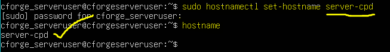

# 4. CONFIGURACION DEL SISTEMA

Una vez finalizada la instalación de los sistemas operativos, se ha realizado la configuración básica de todos los equipos con el objetivo de dejarlos operativos, seguros e integrados en la infraestructura de **CyberForge**.

> *En un entorno real, esta configuración se aplicaría sobre equipos físicos dentro de la red corporativa. En este caso, se ha realizado de forma **simulada mediante máquinas virtuales** utilizando VirtualBox, replicando las mismas tareas de administración que se llevarían a cabo en producción.*
> 

---

## 4.1 CONFIGURACIÓN EN SERVIDORES (UBUNTU SERVER)

1. **Nombre del equipo →** se nombra el equipo para, pej, el servidor principal CPD (`server-cpd`)
    
    
    
2. **Red →** se comprueba la conectividad con `ping`
    
    
    
3. **Actualizaciones del sistema →** usando `apt update` y `apt upgrade`
    
    
    
4. **Acceso remoto (SSH) →** se instala ssh y se habilita
    
    
    
    
    
5. **Configuración horaria:**
    
    
    

---

## 4.2 CONFIGURACIÓN EN EQUIPOS CLIENTE (UBUNTU DESKTOP)

1. **Nombre del equipo  →** se le dará el nombre de `ubuntusystem` (*se reflejará al reiniciar la terminal*)
    
    
    
2. **Red →** se comprueba la conectividad
    
    
    
3. **Actualizaciones del sistema →** se buscan e instalan actualizaciones

```bash
sudo apt update && sudo apt upgrade -y
sudo apt install openssh-server -y
```


1. **Software básico →** se instala el paquete de **net-tools**, que incluye herramientas clásicas como:
    - `ifconfig` → ver/configurar interfaces de red
    - `netstat` → ver conexiones de red
    - `route` → ver tabla de rutas
    - `arp` → ver tabla ARP
    - `nameif` → asignar nombres a interfaces
    
    
    

---

## 4.3 CONFIGURACIÓN EN EQUIPOS CLIENTE (WINDOWS 11 PRO)

1. **Nombre del equipo: Nombre del equipo  →** se le dará el nombre de `windowssystem`
*Configuración → Sistema → Información*
    
    
    
2. **Red →** se comprueba la conectividad
    
    
    
3. **Actualizaciones del sistema** → se ejecuta Windows Update para comprobar e instalar posibles actualizaciones
    
    
    

---

## 4.4 CONFIGURACIÓN DEL SERVER LAB (PROXMOX)

1. **Configuración de red y acceso a la interfaz web verificados** → en el apartado anterior se le asignó una IP estática ( `192.168.1.50` ) y se comprobó el acceso a la interfaz web:
    
    
    
2. **Gestión de almacenamiento** → Uso de:
- `local` (ISOs y backups)
- `local-lvm` (discos de VMs)
    
    
    
1. **Configuración de redes virtuales** → encontramos `vmbr0` (*red con acceso a red rea*l) y `solonet00` (red aislada para laboratorios). Esto permite separar entornos.
    
    
    
2. Creación de máquinas virtuales → en este ejemplo, la VM de Kali se encuentra en la red aislada para poder emplearse en prácticas de laboratorio.
    
    
    

---

## 4.5 CONCLUSIÓN

La configuración de los sistemas se ha realizado siguiendo buenas prácticas de administración, asegurando la operatividad, seguridad y correcta integración de los sistemas dentro de un entorno virtualizado. Se ha comprobado que:

- Los sistemas arrancan correctamente
- Existe conectividad de red
- Los equipos están actualizados
- Se puede acceder a los sistemas