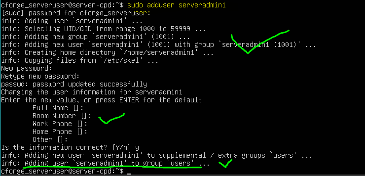

# 5. GESTIÓN DE USUARIOS Y PERMISOS

La gestión de usuarios y permisos es un aspecto fundamental en la infraestructura de **CyberForge**, ya que permite controlar el acceso a los recursos del sistema según el rol de cada usuario.

> En un entorno real, esta gestión se realizaría de forma centralizada mediante servicios como LDAP o Active Directory.
> 
> 
> En este caso, se ha realizado de forma **simulada en sistemas locales**, reproduciendo la organización de usuarios de una empresa real.
> 

---

## 5.1 SERVIDOR PRINCIPAL (UBUNTU SERVER)

- Se crea un usuario nuevo (`serveradmin1`). Esto implica:
    - Creación del usuario `serveradmin1` y de una contraseña para el mismo.
    - Asignación de un UID (o ID interno)
    - Creación de su propio grupo
    - Creación de una carpeta personal
    
    
    
- Se le asignan privilegios administrativos
    
    
    
    Este usuario podrá realizar tareas administrativas en un servidor
    
- Se renombra el grupo en el que estaba por `serveradmingroup`
    
    
    
    ¡Verificado!
    

**Se han establecido en un servidor:**

- El usuario `serveradmin1`
- Se le han otorgado privilegios de administración a dicho usuario
- Se le ha asignado el grupo `serveradmingroup`

---

## 5.2 EQUIPOS DE USUARIO (UBUNTU DESKTOP)

- Se crea un usuario administrador (`ubuntuadmin1`), se le otorgan privilegios de administración y se inicia sesión con este usuario:
    
    
    
- Se crea un **grupo** para cada departamento:
    - Desarrollo → `devgroup`
    - Soporte Técnico → `supgroup`
    - Formación → `ctfgroup`
    
    
    
- Se crean **usuarios**  para los empleados de cada departamento y se les asigna a su grupo correspondiente
    - Desarrollo → `devuser1`
    - Soporte Técnico → `supuser1`
    - Formación → `ctfuser1`
    
    
    

### Ejemplo práctico de la gestión de permisos

Se crea en la raíz (`/`) un directorio para **cada departamento** al que solo podrán acceder los empleados de dicho departamento , mientras que el administrador sigue manteniendo el control total:

Luego se inicia sesión como un **usuario del equipo de desarrollo** y se comprueba que solo puede acceder a la carpeta de desarrollo:

¡Éxito!

**En conclusión, para los equipos de usuario en Ubuntu Desktop tenemos:**

- Un usuario administrador
- Un grupo para cada departamento (Desarrollo, Soporte Técnico y Formación) con permisos limitados
- Usuarios para cada departamento

---

## 5.3 EQUIPOS DE USUARIO (WINDOWS 11)

- Se crea un usuario administrador (`windowsadmin1`), se le otorgan privilegios de administración y se inicia sesión con este usuario:
    
    
    
    
    
    
    
- Se crean **usuarios**  para los empleados de cada departamento y se les asigna a su grupo correspondiente
    - Dirección → `dirgroup`
    - Administración → `admgroup`
    - Usuario de Dirección → `diruser1`
    - Usuario de Administración → `admuser1`
    
    
    

### Ejemplo práctico de la gestión de permisos

Se crea un directorio para **cada departamento** al que solo podrán acceder los empleados de dicho departamento , mientras que el administrador sigue manteniendo el control total

Se han deshabilitado las herencias y se han limpiado permisos

Luego se inicia sesión como un **usuario del equipo de dirección** y se comprueba que solo puede acceder a la carpeta de dirección:

En cambio, si `diruser1`intenta entrar en la carpeta de Administración, se verá obligado a elevar privilegios para entrar…

Para denegar el acceso directamente:

Obviamente, esto está hecho desde windowsadmin1

**En conclusión, para los equipos de usuario en Windows 11 tenemos:**

- Un usuario administrador
- Un grupo para cada departamento (Administración y Dirección) con permisos limitados
- Usuarios para cada departamento

---

## 5.4 Permisos en Proxmox (LO BÁSICO)

En este caso:

- Usuario principal: `root`
- No es necesario crear más usuarios. El acceso a Proxmox está restringido al administrador (root), encargado de la gestión de las máquinas virtuales