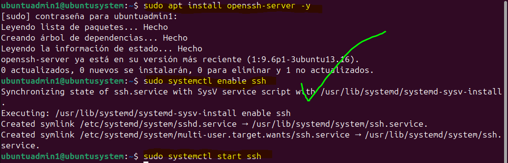

# 6. SERVICIOS BÁSICOS DEL SISTEMA

Finalmente, se configuran y/o se verifican los servicios básicos para cada sistema de la infraestructura de **CyberForge**, con el objetivo de permitir la comunicación, administración y funcionamiento de la red.

> *En un entorno real, estos servicios se desplegarían en servidores físicos dentro del CPD.*
> 
> 
> *En este caso, se han **simulado mediante máquinas virtuales** utilizando VirtualBox.*
> 

---

## 6.1 ACCESO REMOTO

Se ha configurado el acceso remoto en los servidores con OpenSSH, permitiendo su administración sin acceso físico.

### En Ubuntu Server (SSH)

- Ya se ha realizado su instalación y se ha verificado → *ver apartado 4.1 Configuración en Servidores (Ubuntu Server)*

### En Ubuntu Desktop (SSH)

- Instalación  y activación similares

```bash
sudo apt install openssh-server -y
sudo systemctl enable ssh
sudo systemctl start ssh
```



- Comprobación:
    
    
    

### En Windows 11 (Escritorio Remoto)

- Se activa el acceso remoto:
    
    
    

---

## 6.2 COMPARTICIÓN DE ARCHIVOS

Permite el acceso a recursos compartidos entre usuarios.

### Ubuntu

- Se ha creado una carpeta con permisos compartidos para poder compartir archivos **solo** con los grupos `devgroup`y `supgroup`
    
    
    

### Windows

- Se ha creado una carpeta con permisos compartidos para poder compartir archivos con los usuarios `admuser1`y`diruser1`
    
    
    
    
    

---

## 6.3 SERVICIOS BÁSICOS DE RED

### Sistemas Linux

- Se ha comprobado la conectividad por medio de `ping`en apartados anteriores.
- Se instalan las herramientas de red en los sistemas Ubuntu restantes (los servidores como CPD)
    
    
    

```bash
sudo apt install net-tools -y
```

### Sistemas Windows

- Se ha comprobado la conectividad en apartados anteriores, (en este caso de simulación, por medio de una conectividad tipo bridge)

---

## 6.4 CONCLUSIÓN

- Sistemas accesibles de forma remota
- Recursos compartidos entre equipos
- Servicios básicos operativos
- Entorno preparado para prácticas y uso empresarial

---