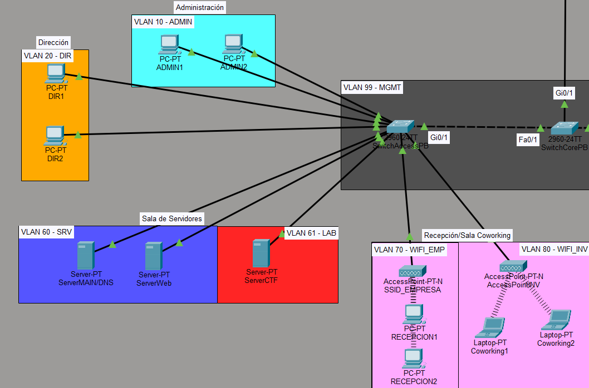
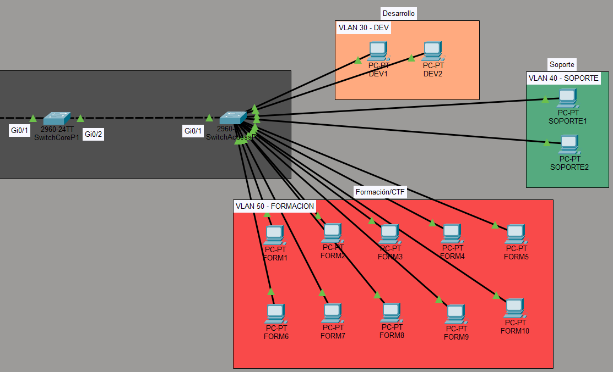
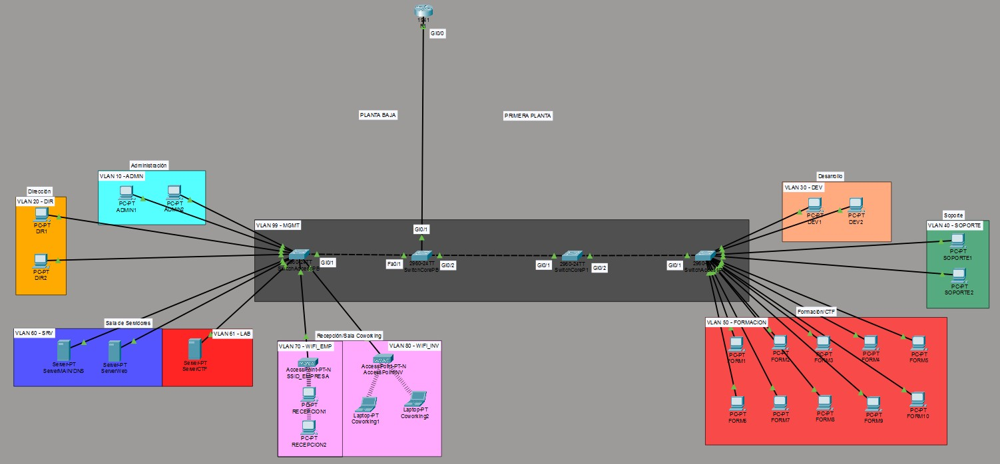

## DISEÑO

Se empleará un diseño Router-on-a-stick, dado que no se prevee una gran necesidad de escalabilidad, además de resultar más económico para una pequeña empresa, y más sencillo de configurar. Un solo router es suficiente para el volumen total de tráfico previsto. Por otra parte, al no usar switches de capa 3, nos estamos ajustando más al equipamiento que solicitan las directrices del proyecto.

La topología general quedaría así:

### Planta baja

### Primera planta

Todo el modelo dependería del Router central, ubicado en la parte superior del diagrama. El Switch Core de la primera planta se enlaza mediante puerto trunk al Switch Core de la planta baja, y éste manda todo el tráfico al router mediante otro puerto trunk. Cada planta tiene también un Switch de acceso que conecta los dispositivos finales:

