## ACCESS CONTROL LISTS

Las políticas de acceso a implementar son las mismas que se piden en la guía del proyecto, y alguna extra para adecuarlo a este emplazamiento concreto. Se adjuntan capturas de la configuración de cada ACL.

---

### El aula de formación NO PUEDE acceder a dirección.

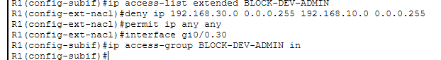

---

### Desarrollo NO PUEDE acceder a administración.

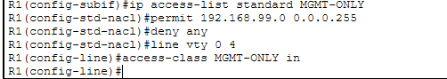

---

### Administración SÍ PUEDE acceder a servidores.

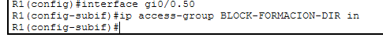

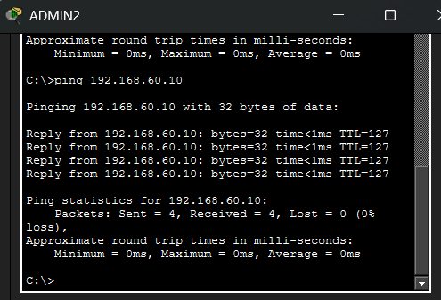

---

### Solo la VLAN99-MGMT puede administrar dispositivos de red.

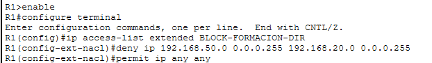

El comando `line vty 0 4` aplica esta norma a todos los switches, para restringir el acceso SSH/Telnet a la VLAN99.

---

### La VLAN61-LAB está aislada del resto de servidores y solo es accesible desde formación, desarrollo y soporte, ya que alberga máquinas vulnerables.

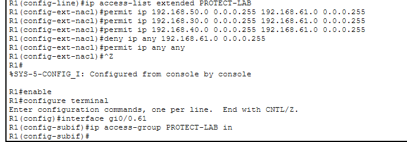

---

### La VLAN61-LAB solo puede emitir tráfico hacia las VLAN de desarrollo, soporte y formación, para evitar que una VM comprometida pueda afectar al resto de la red.

Esta parte debe ser tratada con cuidado en la implantación de sistemas operativos virtuales y firewalls al servidor y a los dispositivos que tienen acceso.

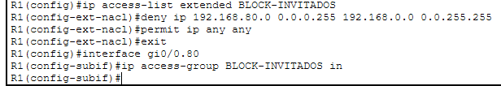

---

### Aislamiento de la VLAN80 del wifi de invitados del resto de la red.

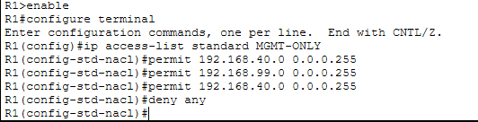

---

### Solo la VLAN40-SOPORTE tiene acceso para acceder a los dispositivos de red de la VLAN99-MGMT.

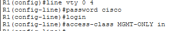

---

### Contraseña de acceso TELNET hacia el router en la VLAN99-MGMT (solo posible desde VLAN40-SOPORTE).

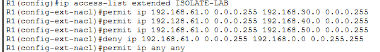

---

### Contraseña de acceso TELNET hacia uno de los switches en la VLAN99-MGMT.

Se añade el comando `transport input telnet` para garantizar la estabilidad de la conexión. Se realiza una configuración idéntica en los cuatro switches:

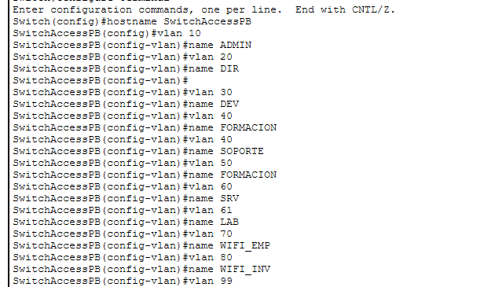
