## CAPTURAS DE PANTALLA DE LAS CONFIGURACIONES PRINCIPALES

---

### Definición de VLANs en uno de los switches (se hizo del mismo modo en los cuatro):

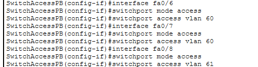

---

### Relación de cada interfaz del switch con su VLAN correspondiente (en la imagen, las correspondientes a VLAN60-SRC y VLAN 61-LAB):

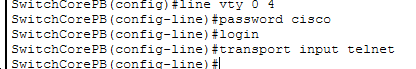

---

### Configuración de los puertos trunk de uno de los switches:

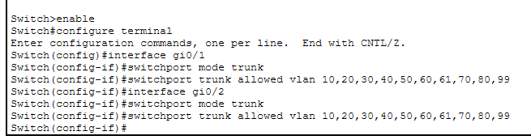

---

### Configuración ip de uno de los switches, con su anexión a la VLAN99-MGMT:

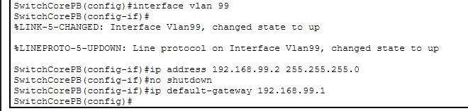

---

### Configuración del router y creación de las VLANs mediante encapsulamiento:

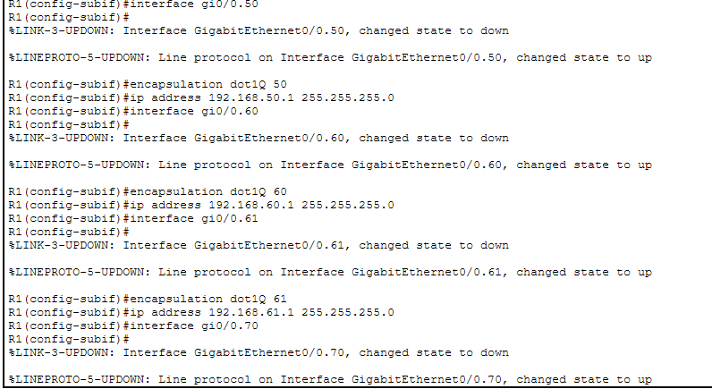

---

### Configuración del DHCP y las direcciones gateway y de server DNS de una VLAN, en este caso la 20-DIR:

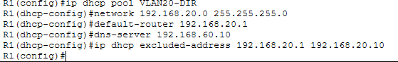

El resto de configuraciones (las referentes a las ACLs) se encuentran en su apartado correspondiente.

---

## PRUEBAS DE CONECTIVIDAD Y BLOQUEO

---

### Ping entre PCs de la misma VLAN (ADMIN1 y ADMIN2):

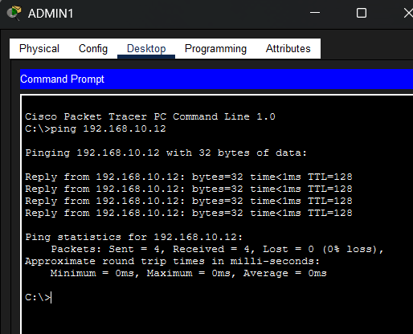

---

### Ping entre VLANs diferentes con acceso permitido (ADMIN-SRV):

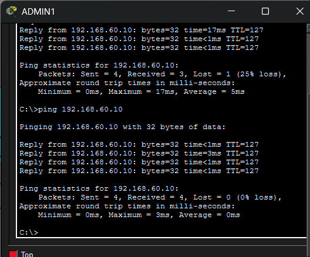

---

### Accesos denegados: FORMACION-DIR

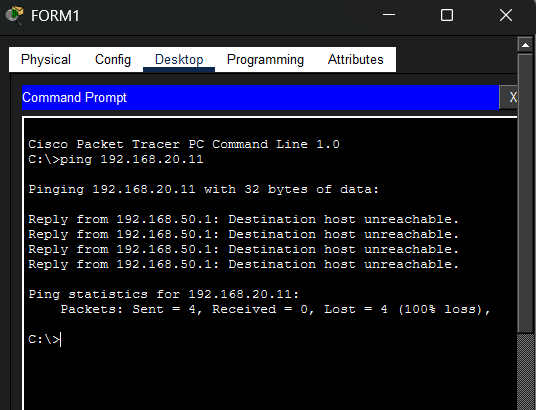

---

### Accesos denegados: DEV-ADMIN

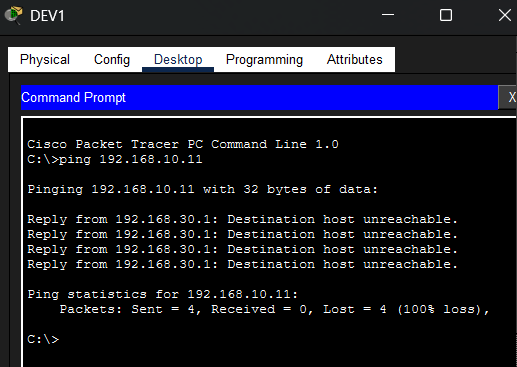

---

### Acceso TELNET desde VLAN40-SOPORTE hacia VLAN99-MGMT, hacia el router y hacia uno de los switches:

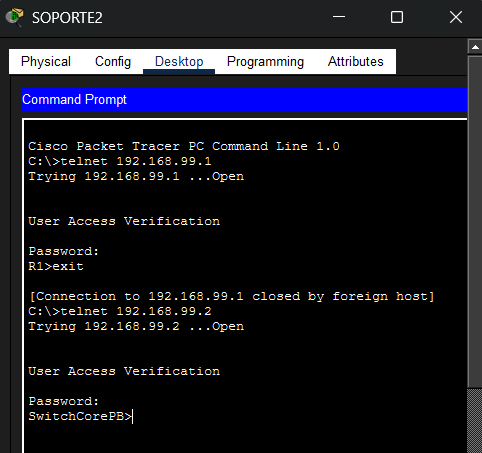

---

### Acceso denegado: telnet hacia VLAN99-MGMT desde el resto de VLANs:

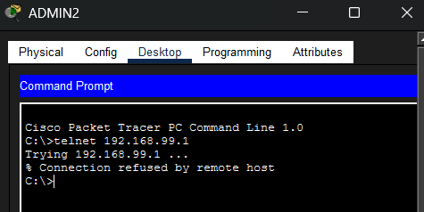

---

### El servidor que aloja las máquinas vulnerables (en la VLAN61-LAB) no tiene conectividad de salida con el resto de la red:

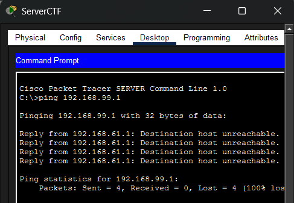

---

### Las salas de formación y desarrollo sí tienen acceso al servidor CTF:

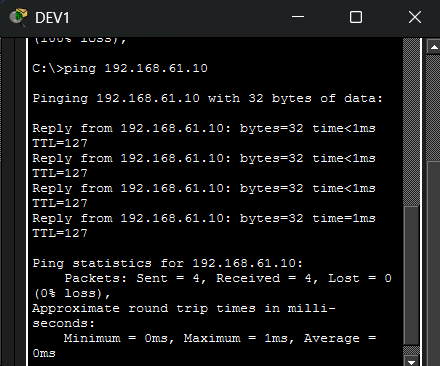

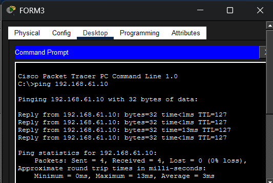

---

### El resto de salas NO tienen acceso al servidor CTF:

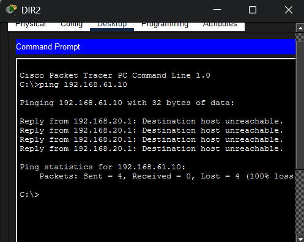

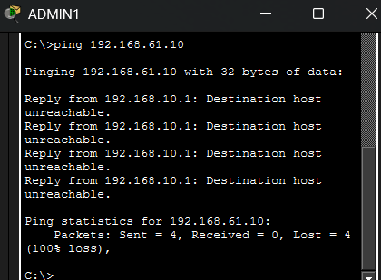

---

### Los clientes del espacio coworking que usan el wifi de invitados (VLAN80) tienen conexión entre sí, pero no con el resto de la red.

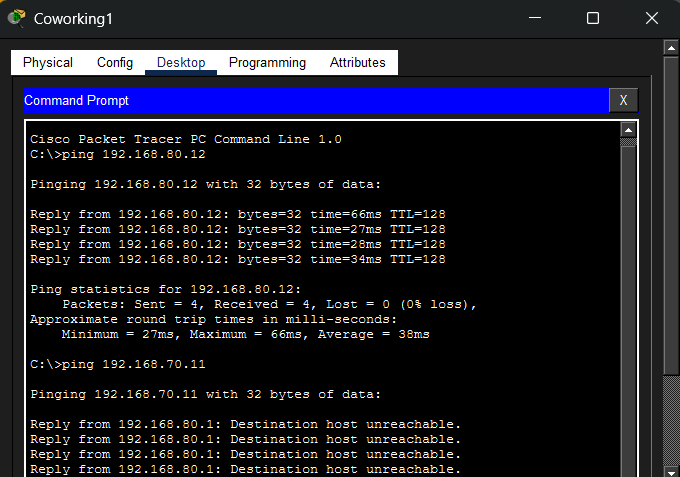
