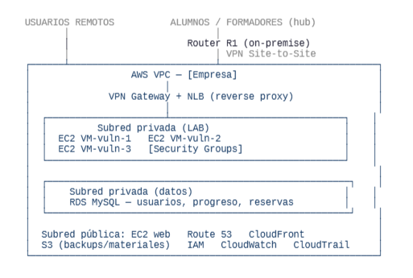

## Arquitectura Cloud Propuesta

Vamos a plantear una **arquitectura híbrida**, combinando la red local del aula física (desarrollada en la parte del Proyecto Intermodular dedicada a la asignatura de Planificación y Administración de Redes) con una VPC en AWS conectada mediante **VPN Site-to-Site**. Esto permite que los dispositivos de la red local y los servicios Cloud se comuniquen como si estuvieran en la misma red, manteniendo la segmentación por VLANs de esa otra parte del Proyecto.

- **Alumnos de la red local:** acceden a las instancias EC2 a través del túnel Site-to-Site. El tráfico viaja cifrado desde el Router R1 hasta el VPN Gateway de la VPC. Desde ahí pasa por el NLB, que lo distribuye entre las instancias disponibles según la carga.

- **Alumnos remotos:** se conectan directamente al NLB a través de Internet. El NLB actúa como punto de entrada único, ocultando las IPs reales de las instancias EC2 y distribuyendo las conexiones. La autentificación se gestiona mediante IAM antes de llegar a las VMs.

- **Web corporativa:** alojada en una instancia EC2 en la subred pública, separada de la subred privada del LAB. Route 53 gestiona el DNS del dominio. Esta separación garantiza que un incidente en el LAB no afecte a la web pública.

- **Base de datos:** alojada en otra subred privada de la VPC, con toda la información relevante del centro, de los profesores y del alumnado. Los alumnos podrán acceder a sus datos desde su perfil en la web (progreso en lecciones, reservas en el centro presencial, etc.). El servicio que gestionará la base de datos es RDS, administrada por el departamento de Administración.

